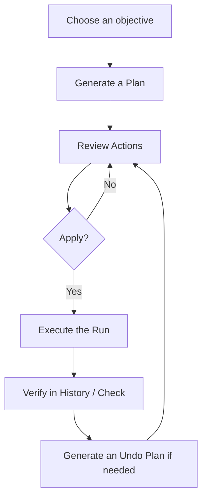

# OMYM2 React Web UI Renewal Plan

> This proposal is retained as planning provenance only. M0 resolved its open
> decisions and folded the normative outcome into `ROADMAP.md`, `docs/PRODUCT.md`,
> `docs/TESTING.md`, `docs/contracts/`, `docs/codebase/web-frontend.md`, and
> `docs/decisions/`. Those authoritative sources override this proposal wherever the
> M0 audit refined a value or removed an obsolete repository assumption.

## 0. Conclusion

The OMYM2 Web UI will be replaced in its entirety as a **clean-room implementation using React + TypeScript + Vite**, rather than being treated as a revision of the existing screens.

The new UI is not intended to be a conventional music library management interface. It will be a keyboard-first local operations console that makes the following safe operating model—OMYM2's distinctive value—easy to understand and use.



The renewal will be divided into the following three stages.

1. **Inspection Console** — Provide Overview, Plans, Library, Health with persisted Check results, and History in the new UI.
2. **Planning Console** — Provide Settings, Check execution, and Plan generation and review for Add, Organize, and Refresh.
3. **Execution Console** — Enable Apply, Cancel, and Undo, along with progress reporting for long-running operations, after the required safe APIs have been added.

The complete cutover will be performed atomically within a single package. The old and new UIs will not coexist behind a feature flag, and the existing UI will not be migrated incrementally on a screen-by-screen basis.

---

## 1. Clean-room Constraints

### 1.1 Approved Sources

- The colors, typography, spacing, corner radii, borders, and component principles in the provided `DESIGN.md`
- OMYM2's architecture, domain model, execution contracts, configuration contracts, and JSON API contracts
- The Python-side Web adapter, composition, serializers, package data, and CI configuration
- Official documentation for React SPA distribution, routing, and testing

### 1.2 Prohibited Sources

The following must not be referenced or reused during investigation, design, implementation, or review.

- Existing frontend components, screen layouts, navigation, or copy
- Existing HTML, CSS, JavaScript, TypeScript, or TSX
- Screenshots, mockups, Storybook stories, or visual tests from the existing UI
- Class names, DOM structures, assets, or icon choices from the existing UI
- Feature mapping tables, difference comparisons, or pixel comparisons against the existing UI

Documents containing UI-specific descriptions must not be used except to confirm distribution boundaries.

### 1.3 Isolation During Implementation

- Begin the new implementation in an empty `web-v2/` directory.
- Explicitly prohibit the implementing agent/developer from reading the old frontend path.
- Limit the initial PR to new files and changes to API/distribution boundaries.
- Immediately before cutover, mechanically delete the old frontend and rename `web-v2/` to `web/`.
- During review, verify that there are no imports, assets, class names, copy, or dependency packages derived from the old frontend.
- Evaluate UI quality against `DESIGN.md`, accessibility criteria, fixtures, and acceptance tests—not through comparisons with the old UI.

---

## 2. Product Direction

### 2.1 Goals

- Make the Plan-centered safety model understandable without requiring knowledge of the CLI.
- Prevent users from misunderstanding the meanings of `blocked`, `failed`, `partial_failed`, and `pending`.
- Support large volumes of Track, PlanAction, and FileEvent records through search, filtering, grouping, and keyset pagination.
- Allow primary operations to be initiated from `⌘K` / `Ctrl+K`.
- Delegate every file mutation to backend use cases; do not reimplement PathPolicy or conflict detection in React.
- Preserve the localhost, offline-first, and no-telemetry characteristics.
- Bundle the static SPA in the Python wheel without requiring Node.js at runtime.

### 2.2 Non-goals

- Music playback
- Tag editing
- Cover art management
- Streaming service integrations
- Arbitrary file overwrites from the browser
- Cloud synchronization, accounts, authentication, or analytics
- Multi-library management in the initial release
- Automatic repair of `pending` FileEvents
- Layout compatibility with the old UI

### 2.3 Recommended Scope Decision

The final target includes applying Plans and undoing Runs. However, mutation must not be enabled before browsing, settings, and Plan generation are complete. Apply and Undo will be introduced as the final feature slice, after the API, conflict control, progress reporting, E2E coverage, and safety verification are all in place.

---

## 3. UX Principles

### 3.1 Command-first, Not Command-only

- Open the Command Center with `⌘K` / `Ctrl+K`.
- Make navigation, Plan creation, Check execution, opening Settings, and reopening recent items searchable.
- Every operation must also be available through visible UI controls. Users who do not know the shortcuts must not be excluded.
- Do not hide operations whose backend capability is disabled; show why they are disabled and how to resolve the issue.

### 3.2 Review Before Mutation

- Add, Organize, Refresh, and Undo must not be implemented as buttons that move files immediately.
- Always navigate to Plan Review after generating a Plan.
- The Apply confirmation must show at least the following information at the same time:
  - Number of executable moves
  - Number of metadata-only updates
  - Number of skips
  - Number of blocked actions
  - Library root
  - Factors affecting Undo availability
- Explicitly state that a Plan containing blocked actions can still be applied, and display the number of successful actions and the number of unresolved blocked actions as separate metrics.

### 3.3 Backend-authoritative Behavior

- React must not infer permitted operations from status values.
- The backend returns `capabilities` and `disabled_reasons`.
- Only the backend determines canonical paths, duplicates, conflicts, required metadata, and Undo eligibility.
- Do not parse opaque cursors; pass them unchanged to the next request.
- Treat the full UUID as the authoritative identifier. It may be abbreviated on screen, but copying must use the full ID.

### 3.4 Explicit Uncertainty

- Explicitly state that `partial_failed` does not mean the operation has been rolled back.
- Because a `pending` FileEvent may have an unknown outcome, do not present an automatic repair CTA.
- A terminal Plan cannot be applied again. Describe the next step as “Create a new Plan from the current state,” not as Retry.
- Do not rely on error messages alone; display the error code, affected target, and recommended action.

### 3.5 Keyboard and Focus

- `↑` / `↓`: Select a row
- `Enter`: Open details
- `⌘Enter` / `Ctrl+Enter`: Execute the primary action for the current context
- `Esc`: Close a dialog/palette, or return from details to the list
- `/`: Focus list search, except while editing an input
- `?`: Open shortcut help
- Normalize shortcuts across operating systems, and ensure that single-character shortcuts do not interfere with editable elements or screen-reader navigation.
- Explicitly manage focus restoration targets after route transitions, dialog closure, and mutation completion.

---

## 4. Information Architecture

Throughout this plan, **Health** names the UI surface at `/health`; **Check** names the backend operation and its persisted result.

### 4.1 Top-level Routes

| Route | Purpose | Primary action |
| --- | --- | --- |
| `/` | Overview of readiness, ready Plans, the latest Check, and the most recent Run | Add music |
| `/plans` | Plan list with status/type filters | Create Plan |
| `/plans/new/add` | Create an Add Plan from Incoming or another source | Scan and create plan |
| `/plans/new/organize` | Create a Plan for Library registration/reconciliation | Scan library |
| `/plans/new/refresh` | Create a Refresh Plan for a file/directory/all | Create refresh plan |
| `/plans/:planId` | Plan header, summary, actions, groups, Apply/Cancel | Apply plan |
| `/library` | Track search, `active / removed` filter, artist/album grouping | Refresh path… |
| `/library/:trackId` | Track metadata, current/canonical path, hash, and links to history | Refresh track |
| `/health` | Latest Check issues, facets, groups, and `checked_at` | Run check |
| `/history` | Run list with status filter | None |
| `/history/:runId` | Run, FileEvents, failures, and Undo eligibility | Create undo plan |
| `/settings` | Paths, PathPolicy, Artist IDs, Metadata, and Collision | Review and save |

### 4.2 Application Shell

| Region | Desktop | Tablet / Mobile |
| --- | --- | --- |
| Global bar | App identity, Command Center trigger, operation indicator | Sticky compact bar |
| Navigation rail | Overview / Plans / Library / Health / History / Settings | Modal drawer |
| List pane | 320–420px, search/filter/group, virtualized rows | Full-width route |
| Detail pane | Remaining width, sticky contextual action bar | Separate route with Back |
| Operation surface | Top-level compact progress + detail dialog | Bottom sheet / full-screen dialog |

On desktop, use a two-pane list-detail layout as the default. Even with the navigation rail included, no more than three regions may be arranged side by side. The URL retains the selected entity and filters so that state can be restored on reload or through a deep link.

### 4.3 Overview

Overview is not a decorative dashboard. It must enable users to answer the following questions quickly.

1. Is the Library ready for Add?
2. Are there any ready Plans awaiting review?
3. When did the latest Check run, and how many unresolved issues remain?
4. Did the most recent Run succeed, partially fail, or fail?
5. What is the shortest next operation the user should perform?

Limit cards to no more than four groups. Do not use a large marketing hero or charts. Only on first use, show a guided empty state for Settings → Organize → Plan Review → Apply.

### 4.4 Command Center

Display search results in the following group order.

1. Recommended action
2. Commands
3. Recent Plans / Runs
4. Tracks
5. Navigation

The initial version combines a client-side command catalog, a recent-query cache, and the existing Track search API. Add a cross-entity search API only after measuring the need for it.

---

## 5. Primary Flows

### 5.1 First Run / Library Registration

1. Retrieve Config validation, Library state, and capabilities during Bootstrap.
2. If the Library is not registered, display a guided state.
3. Enter Paths and PathPolicy. The Library path in Config is a shortcut, not the Library identity.
4. Display the backend preview and validation results.
5. Review the diff and save Settings.
6. Pass the Library PATH explicitly confirmed by the user to the Organize use case. The backend generates `library_id`; do not infer it from the Config path.
7. If a Plan is generated, navigate to Plan Review.
8. If a clean registration requires no Plan, show that registration is complete and return to Overview.
9. Do not treat the Library as ready while blocked actions remain.

### 5.2 Daily Add

1. Start Add from the Command Center or Overview.
2. Show the configured Incoming path as the default, and allow the source path to be overridden when necessary.
3. Start the scan as a background operation.
4. Open Plan Review when the scan completes.
5. Review the summary, directory groups, blocked reasons, and source → target mappings.
6. Start the Run after Apply is confirmed.
7. On completion, provide links to Run details and the remaining blocked-action count.

### 5.3 Plan Review

The Plan header displays the following.

- Type, status, `created_at`, and a control for copying the full ID
- Library and `library_root_at_plan`
- Counts by action type/status
- Config hash
- Backend-provided capabilities

The Action list combines cursor pagination with virtualization and supports filtering by status, `action_type`, and `target_directory`. Each row must make the action type, source, target, status, and reason understandable at a glance. The selected row's inspector displays the hash, Track ID, and an explanation of the reason.

Use exactly one white primary button in the Apply dialog. Even when a destructive outcome is expected, do not use a solid red CTA; communicate the risk through warning badges, icons, and copy.

### 5.4 Refresh

- Refresh can be started from Track details or the Command Center. From Track details, pass that Track's current path as the file target.
- Explicitly select the target as file/directory/all.
- The initial version does not include a contract for directly targeting an arbitrary multi-Track selection or an artist/album group. If needed, design it as a separate feature/use case in P2.
- Display separate counts for `move` and `refresh_metadata`.
- Under the current history model, a Run containing `refresh_metadata` cannot be undone; display this fact persistently before Apply.
- Explain that unchanged items do not become Plan actions.

### 5.5 Health / Check

- GET displays only the persisted latest Check and must not scan the filesystem every time the screen is shown.
- Always display `checked_at` and the issue count.
- Treat Check execution as a long-running operation.
- Allow navigation from groups by issue type to individual paths, Tracks, and Plans.
- Display a `pending` FileEvent as “manual review required” and do not repair it automatically.

### 5.6 History / Undo

- Separate Runs from FileEvents, with drill-down from the Run summary to the event list.
- For a partial failure, allow succeeded and failed events to be compared on the same screen.
- A Run containing only skip, blocked, or `refresh_metadata` actions may succeed with zero FileEvents. Display the linked PlanAction summary and do not treat an empty event list as abnormal.
- The backend returns `can_create_undo` and the reason for any refusal.
- Undo does not revert the filesystem directly from the Run; it generates an Undo Plan and sends it to Plan Review.
- Before Apply, display the absolute path of any external restore destination and state that the Track will become `removed` from the Library.
- If the restore destination already exists, do not overwrite it automatically; return it to review as a blocked action.

### 5.7 Settings

Divide Settings into the following sections.

1. Paths
2. Path Policy + live preview
3. Artist IDs
4. Required Metadata
5. Collision Policy
6. Advanced

Forms retain local drafts, while backend validation remains authoritative. Fetch the Path preview with a debounce after input stops. Before Save, display a before/after diff and use optimistic concurrency through the `config_revision` described below to detect concurrent changes from the CLI or other clients. If a conflict occurs, do not overwrite it; let the user choose to reload or reapply their changes.

Saving a change that affects the PathPolicy fingerprint makes the existing Library stale, and Add remains unavailable until Organize completes again. Warn about this impact before saving. After saving, refetch Bootstrap/capabilities and display the reason Add is disabled together with a link to Organize. Only the backend determines whether `{artist_id}`-related settings affect the fingerprint, including whether the active template uses that placeholder.

---

## 6. Applying DESIGN.md to the Application UI

### 6.1 Core Tokens

| Token | Value | App usage |
| --- | --- | --- |
| Canvas | `#07080a` | Full-screen background |
| Surface | `#0d0d0d` | Rail, list, card |
| Surface elevated | `#101111` | Input, active control, detail section |
| Surface card | `#121212` | Selected row, keycap, nested panel |
| Hairline | `#242728` | Pane, card, and row dividers |
| Ink | `#f4f4f6` | Primary text |
| Body | `#cdcdcd` | Body text |
| Mute | `#9c9c9d` | Metadata, timestamps |
| Ash | `#6a6b6c` | Disabled and terminal neutral states |
| Primary | `#ffffff` | The only primary action within a context |
| Blue | `#57c1ff` | Running/pending/informational |
| Green | `#59d499` | Succeeded/applied/registered |
| Yellow | `#ffc533` | Blocked/stale/warning |
| Red | `#ff6161` | Failed/destructive warning |

Do not communicate state through color alone. Give every status badge a text label or accessible name. Limit accent colors to small badges, icons, and status dots; do not use them across large areas of application chrome.

### 6.2 Typography

- Self-host Inter so that no external font request is made.
- Enable `font-feature-settings: "calt", "kern", "liga", "ss03"` at the root.
- Use 16px for body text, 12–14px for dense metadata, and 20–24px for page titles as the baseline.
- Do not use 56–64px display typography on routine screens. Reserve it for the initial guided state.
- Use a self-hosted monospace fallback to display paths, UUIDs, and hashes.

### 6.3 Shape and Depth

- Use only 4 / 6 / 8 / 10 / 16px corner radii.
- Express elevation using only the surface ladder and 1px borders.
- Do not use drop shadows.
- Use 16–24px card padding and 8–12px for dense rows.
- Use 24–32px section gaps on routine screens. Reserve 96px gaps for the initial guided state.

### 6.4 Red Stripe Motif

Use the red diagonal stripe no more than once, as the top band of the initial guided state. Do not use it in Overview, Plan Review, Settings, dialogs, or toasts. Prioritize operation state over decoration.

### 6.5 Dark-only Decision

The new UI is dark-only. Do not implement a light mode that conflicts with `DESIGN.md`. Retain the UI theme field in the existing Config contract for compatibility during the initial cutover, but always treat the new UI as dark. Deprecating or migrating the field is a separate change and must not be mixed into the scope of this renewal.

### 6.6 Required Primitives

- AppShell
- CommandCenter
- NavigationRail / NavigationDrawer
- SearchField / FilterBar / FacetMenu
- VirtualList / EntityRow / DetailInspector
- StatusBadge / StatusSummary
- Keycap
- PrimaryButton / SecondaryButton / IconButton
- Dialog / ConfirmDialog / BottomSheet
- InlineError / ErrorPanel / Toast
- EmptyState / LoadingSkeleton
- PathPreview / SourceTargetDiff
- OperationIndicator / OperationDetail

---

## 7. React Technical Design

### 7.1 Stack

| Area | Decision |
| --- | --- |
| UI runtime | React + TypeScript strict mode |
| Build | Vite SPA |
| Routing | React Router, route-level lazy loading |
| Server state | TanStack Query |
| Forms | React Hook Form + backend validation. Client-side schemas are used only to support input typing |
| Accessible primitives | Use headless primitives, with visual styling standardized through custom tokens |
| Styling | CSS custom properties + CSS Modules |
| Icons | A single local SVG icon set. Status is accompanied by text |
| Unit/component test | Vitest + React Testing Library + user-event + MSW |
| Browser test | Playwright, minimal E2E + keyboard + accessibility |
| API typing | Generate TypeScript types/client from FastAPI OpenAPI |

Package major versions will not be pinned in this plan; the stable versions available at the start of implementation will be pinned in the lockfile.

The Node runtime version will be aligned with the repository's CI and pinned in both `engines` and `.node-version`. Node will not be included in the runtime package.

### 7.2 Directory layout

```text
web-v2/
  package.json
  vite.config.ts
  tsconfig.json
  src/
    app/
      router.tsx
      providers.tsx
      app-shell.tsx
    api/
      generated/
      client.ts
      errors.ts
      query-keys.ts
    design/
      tokens.css
      global.css
    components/
      primitives/
      layout/
      feedback/
    features/
      bootstrap/
      command-center/
      overview/
      plans/
      library/
      health/
      history/
      settings/
      operations/
    test/
      fixtures/
      msw/
```

### 7.3 State ownership

- URL: selected entity, query, filter, group, sort, detail state
- TanStack Query: API responses, cursor pages, facets, capabilities, operation polling
- Form library: unsaved Settings draft
- Component state: open/closed, hover, temporary selection
- Small app context: Command Center, global operation indicator, toast queue

A general-purpose global store such as Redux will not be introduced initially. Server data will not be duplicated into another store.

### 7.4 Data fetching

- Lists pass the opaque `next_cursor` through `useInfiniteQuery`.
- When filters change, reset the cursor and update the URL and query key together.
- Virtualize rows to avoid rendering every item in the DOM.
- Treat details, facets, and groups as independent queries, and fetch only those required in parallel.
- After a mutation completes, explicitly invalidate the relevant Plan, Run, History, Check, and Overview queries.
- Only for a 403 with `code=csrf_invalid`, refresh Bootstrap once and retry once, and only for operations explicitly defined as safe to resend. Do not automatically resend mutations after a generic 403 or network timeout.
- Do not automatically retry 4xx validation/conflict responses. Do not automatically retry mutations for network/5xx failures either.

### 7.5 Error boundaries

- Place layered error boundaries at the app shell, route, and detail pane levels.
- A failure to retrieve a single detail view must not bring down the entire navigation experience.
- Display a persistent banner when the server disconnects.
- Do not inadvertently expose raw exceptions, stack traces, or absolute paths in toasts.

---

## 8. Backend / API Change Plan

### 8.1 Boundaries to preserve

- The Web is an inbound adapter that calls feature use cases.
- The domain/feature layers do not depend on React, FastAPI, SQLite, or filesystem implementations.
- Concrete adapters are assembled only in platform composition.
- The UI does not access TOML, SQLite, or the filesystem directly.
- Library audio mutations must always pass through the Plan, Run, and FileEvent contracts.

### 8.2 P0: typed response and error contract

Define Pydantic request/response models for every route; do not duplicate the field shapes of handwritten dictionaries in React. This coordinated breaking change replaces the existing `errors: string[]`; update the SPA, `docs/contracts/web-api.md`, serializers, unknown-API-response handling, and tests in a single cutover.

```ts
type ApiEnvelope<T> = {
  data: T | null
  errors: ApiError[]
}

type ApiError = {
  code: string
  message: string
  field?: string
  retryable: boolean
  remediation?: {
    label: string
    route?: string
    command?: string
  }
}
```

For a normal success, use `data != null / errors = []`; for a failure, use `data = null / errors != []`. Bootstrap alone may return recovery-oriented partial data and a degraded error simultaneously.

Freeze status codes and handlers in M0.

- `200`: completion of a read operation or a short idempotent update
- `201`: synchronous resource creation completed
- `202`: durable background operation accepted. Return the status URL in `Location`
- `400`: the request itself is malformed, such as a JSON decoding failure
- `403`: CSRF failure
- `404`: entity/operation not found
- `405`: method not allowed
- `409`: state, revision, or active operation conflict
- `410`: operation beyond its retention period
- `422`: body/field validation
- `500`: unexpected server error. Return only a redacted message to the client

Implement app-level handlers that convert `RequestValidationError`, `HTTPException`, 405 responses, unknown routes, and unexpected exceptions into the same envelope. Preserve details in server logs with a correlation ID, and do not return raw exceptions/stack traces to the client. Include every error response model in OpenAPI as well.

Only `ApiError.code` is a closed catalog. As in the current contract, `FileEvent.error_code` permits unknown stable snake_case values, and the UI provides an unknown-value fallback.

Because the SPA and API are distributed together in the same package, `/api/v1` will not be introduced initially. This is a deliberate breaking replacement of the existing API; record in an ADR that external Web API clients are not officially supported.

### 8.3 P0: OpenAPI generation

- Provide a schema-only app factory that does not require a concrete DB, Config, filesystem, or network.
- Export OpenAPI after the Python-side schema tests.
- `npm run api:generate` performs OpenAPI export, followed by TypeScript schema/client generation.
- Commit generated source so API diffs can be reviewed in pull requests.
- `npm run api:check` detects drift after regeneration using the equivalent of `git diff --exit-code`.
- The CI order is Python schema test → OpenAPI export → TypeScript generate/check → frontend typecheck.

### 8.4 P0: Bootstrap and Libraries

Endpoints to add:

```text
GET /api/bootstrap
GET /api/libraries
GET /api/libraries/{library_id}
```

Bootstrap returns the app version, CSRF token, runtime capabilities, Library-selection diagnostics, Config-validation summary, and status/reason catalog version.

CSRF issuance must not depend on Config/DB health. Even if Config or the DB is broken, Bootstrap returns a 200 degraded response so Settings can be repaired. If a Library cannot be selected unambiguously, return `active_library: null` with diagnostics rather than silently selecting one.

The Library response returns `library_id`, root, status, registration state, and the PathPolicy fingerprint. The initial UI presents a single Library, but `library_id` is retained in the types and routes.

### 8.5 P0: Capabilities and presentation ownership

Add backend-authoritative capabilities to Plan/Run details. They are computed by feature use cases, not by route adapters.

```ts
type PlanCapabilities = {
  can_apply: boolean
  can_cancel: boolean
  can_recreate: boolean
  disabled_reasons: ApiError[]
}

type RunCapabilities = {
  can_create_undo: boolean
  disabled_reasons: ApiError[]
}
```

The backend is the source of truth for state transitions, operation availability, and disabled reasons. The frontend provides exhaustive mappings for labels, tones, icons, and copy, with fallbacks for unknown values. Capabilities are revalidated at mutation time; values obtained for display alone are not trusted.

### 8.6 P0: Settings concurrency

A Plan's `config_hash` is audit information for the Config at review time, not a concurrency token for Settings. A Config change after Plan creation does not, by itself, expire the Plan, and saved PlanActions are not recalculated.

Introduce a separate opaque `config_revision` in ConfigStore. The revision is a raw-storage revision capable of distinguishing a missing file, invalid raw TOML, valid Config, and an external update with identical content.

- `GET /api/settings` returns `config_revision`.
- Validation/save requests include `expected_config_revision`.
- SaveSettingsUseCase obtains the shared cross-process lock, rechecks the revision, and then performs an atomic replace.
- CLI Config saves use the same lock/revision protocol.
- A mismatch results in `409 config_changed`; silent overwrites are prohibited.

### 8.7 P0: Durable operation substrate

Build the operation substrate before first implementing Add/Organize/Refresh scans and Check. Apply and Undo will later be added to the same substrate.

```text
GET /api/operations/{operation_id}
```

Persist operations durably in SQLite and model them as a discriminated union by kind. The minimum statuses are `queued / running / succeeded / failed / interrupted`. Results are typed separately by kind, such as `plan_created`, `registered_without_plan`, `check_completed`, and `run_started`.

A POST request that starts an operation requires a client-generated `Idempotency-Key`. The backend durably stores the key, operation kind, and request fingerprint. Resending the same key with the same payload returns the existing OperationRef; using the same key with a different payload results in a 409.

Progress includes `stage_code`, optional completed/total values, and an optional redacted message. Until a use case provides a progress callback, show an indeterminate state rather than a fabricated percentage.

Use polling as the initial transport. Return the status URL in the response, and define the polling interval/backoff, post-completion retention period, and 404/410 behavior in the contract. Consider SSE after measurement; WebSocket is not adopted.

Any queued/running operation left behind after a process restart is not resumed automatically; mark it `interrupted`. If a Run has already been created, reconcile it with the Plan/Run/FileEvent records. If `pending` FileEvents exist, do not infer an outcome; direct the user to Check and manual review.

### 8.8 P0/P1: Cross-process exclusion and atomic acceptance

Both the Web and CLI use the same application-root operation lock protocol. The initial release takes the conservative approach and permits only one exclusive state-changing operation. Reject another operation with `409 operation_in_progress` rather than queueing it.

| Active | Requested GET | Settings save / Plan scan / Check / Apply / Cancel / Undo Plan |
| --- | --- | --- |
| none | allow | acquire the cross-process lock via the shared Web/CLI protocol, then run |
| exclusive operation | allow read-only snapshot | reject with 409 |

This prevents Check/scan during Apply, Config saves during a scan, Apply racing with Undo Apply, and Apply racing with Cancel. The lock is a cross-platform adapter that coordinates across processes and is safely released after crashes; M0 freezes the concrete lock-file or lease mechanism in an ADR. Do not rely on a SQLite write lock alone to protect long-running filesystem mutations.

Before returning `202` for an Apply request, atomically claim the following:

1. Acquire the cross-process lock.
2. Verify the current Library root against `library_root_at_plan`.
3. In a compare-and-set within one transaction, commit the Plan transition `ready → applying`, creation of a `running` Run, and the durable operation reservation.
4. Hand the operation to a worker after the commit.

Plan/Run details return the associated `active_operation_id`, and a 409 response also provides a path to the existing operation. For two concurrent Apply requests, Apply versus Cancel, or a retry after a lost response, only the single request that successfully claims the operation succeeds. Capabilities are not a substitute for this CAS.

### 8.9 P0: Plan creation response normalization

Plan generation and Check return `202 + OperationRef`. On operation completion, a `plan_created` result contains only the Plan header and ID; it does not embed all PlanActions. Actions are retrieved from a cursor-pagination endpoint.

A clean registration in Organize that requires no Plan is not a failure; model the operation result as the following discriminated union:

```ts
type OrganizeOperationResult =
  | { kind: "plan_created"; plan_id: string }
  | { kind: "registered_without_plan"; library_id: string; track_count: number }
```

If the UI uses `Plan.summary` to display counts, replace the opaque map with a typed summary by action type/status.

### 8.10 P1: Apply / Cancel / Undo normative contract

Endpoints to add:

```text
POST /api/plans/{plan_id}/apply
POST /api/plans/{plan_id}/cancel
POST /api/history/{run_id}/undo-plan
```

- Apply uses only saved PlanActions and does not recalculate targets from the current AppConfig.
- Applying a terminal Plan results in a `409`.
- If the root mismatches before Run creation, mark the Plan `expired` and do not create a Run/FileEvent.
- If a root mismatch is detected after Run creation, stop and set the Plan/Run to `failed` or `partial_failed`, depending on whether any preceding actions succeeded. Do not create a FileEvent for the mismatch itself.
- An apply-time precondition failure marks the PlanAction `failed`, but does not create a FileEvent if no mutation occurred.
- Cancel passes through CancelPlanUseCase and permits only `ready → cancelled` through CAS. In a race with Apply, only one succeeds.
- Cancel after Apply has begun is not provided in the initial release.
- Only terminal Runs are eligible for Undo; reject Runs that include `refresh_metadata`.
- Undo creates an Undo Plan from succeeded FileEvents in reverse order and does not modify the filesystem directly.
- A restore-destination conflict becomes a blocked action rather than being overwritten automatically.
- Applying an Undo Plan also goes through the normal single-use Apply flow.
- If a ready Undo Plan already exists for the same source Run, return its ID. If an applying/applied Undo Plan exists, return `409 already_undone_or_in_progress` and do not create a duplicate Plan.

### 8.11 P2: Optional API

Add the following only if measurements demonstrate they are needed.

- unified entity search
- dashboard aggregate
- historical CheckRun list
- multi-library switch/relink
- operation SSE
- user-triggered operation cancel

---

## 9. Distribution Architecture

### 9.1 Runtime

- FastAPI binds only to `127.0.0.1`.
- Do not start a Node runtime in production.
- Bundle the Vite build in the Python package's `static_dist/`.
- Always process `/api/*` as JSON; do not pass it through to the SPA fallback.
- Serve `/assets/*` as hashed assets, returning 404 when an asset is absent.
- For all other GET requests with `Accept: text/html`, return `index.html` with HTTP 200 and let React Router display Not Found. Lock down the handling of `*/*`, non-HTML Accept values, dotfiles, and path traversal in integration tests, and do not pass API/asset requests through to the fallback.
- Use no-cache for `index.html` and a long-lived immutable cache for hashed assets.
- Keep the API operational even when the build is absent, returning 503 only for UI routes.

### 9.2 Development

```text
FastAPI : 127.0.0.1:8765
Vite    : development port, proxy /api to FastAPI
```

Do not add CORS. Reproduce the same-origin contract through the Vite proxy.

### 9.3 Build pipeline

```text
npm ci
→ Python API schema test
→ OpenAPI export + api:check
→ format check
→ lint
→ typecheck
→ unit/component test
→ Vite build to web/dist
→ export audit
→ completely replace static_dist
→ uv build
→ wheel / sdist content audit
→ clean install
→ installed-package smoke test
```

The export audit verifies the following:

- `index.html` exists.
- Asset references remain within package-relative paths.
- There are no remote URLs outside the allowlist, analytics, source maps, or unexpected inline scripts. Prevent false positives by allowlisting URLs required by specifications, such as the SVG namespace.
- Only hashed filenames are eligible for long-lived caching.
- Font licenses and files, including Inter, are included in `static_dist/licenses/` and in the wheel/sdist.

During development in `web-v2/`, temporarily point the CI, npm cache path, check scripts, and development command working directories to that directory. Revert them to `web/` in the same commit as the M5 rename, and perform a clean build against the final path.

Decide the official distribution path in M0, and preserve the wheel/sdist generated from the final commit as a CI artifact or release artifact. Include the required built static assets in the sdist and verify that a wheel can be rebuilt from the sdist without Node.

### 9.4 Security and privacy

- Require loopback binding.
- Restrict allowed hosts to `127.0.0.1` / `localhost`. Permit the Vite proxy and TestClient's `testserver` only in development/test profiles.
- Obtain the CSRF token from Bootstrap and attach it to every state-changing request.
- Configure CSP, `X-Content-Type-Options: nosniff`, `Referrer-Policy: no-referrer`, and framing prohibition. Preserve `script-src 'self'`; use an M1 spike to determine whether the virtualized list or headless primitives require inline styles, and minimize `style-src-attr`.
- Do not use a CDN, remote fonts, analytics, or a service worker.
- Do not send absolute paths or hashes externally.
- Do not return raw Python exceptions or stack traces in error responses.

---

## 10. Testing Strategy

### 10.1 Frontend unit / component

- domain status → label/tone mapping
- cursor pagination reset when filters change
- success/empty/400/403/404/409/500 states
- CSRF header attachment and token refresh
- capability-based button enablement/disablement
- Plan summary counts and blocked indicators
- Settings diff, unsaved changes guard, and config conflicts
- keyboard navigation and focus restoration
- reduced motion

### 10.2 API contract

- consistency between Pydantic schemas and serializers
- generated TypeScript artifacts are up to date
- closed catalog for `ApiError.code` and fallback behavior for unknown `FileEvent.error_code` values
- complete capability coverage across all status transitions
- Apply single-use behavior, root mismatch, blocked actions, and partial failure
- Undo eligibility, `refresh_metadata` rejection, and external restore
- operation conflicts and reconciliation
- two simultaneous Apply requests, Apply versus Cancel, and Apply versus Check/Plan scan
- two simultaneous Config saves and conflicts with CLI saves
- worker crashes before Run creation, after Run creation, and after leaving a FileEvent pending
- reconciliation after loss of a `202` response
- Settings-based recovery from degraded Bootstrap

### 10.3 Python Web integration

- SPA deep-link fallback
- unknown `/api` routes return JSON 404 responses
- missing `/assets` resources return 404 responses
- when the build is missing, the UI returns 503 while the API remains operational
- path traversal rejection
- cache/security headers
- CSRF failure

### 10.4 Browser E2E

Use only a temporary application root, temporary Config/DB, temporary music files, an ephemeral port, and a programmatic app factory. Do not depend on automatically opening a browser. Automate at least the following:

1. first run → Settings validation/save → both Organize outcomes: `plan_created` and `registered_without_plan`
2. Add Plan → review → Apply → successful History
3. display of a Plan containing blocked actions
4. Run detail for a partial failure
5. eligible Run → Undo Plan → review → Apply → filesystem restoration → History record
6. keyboard-only Command Center navigation
7. deep-link reload
8. accessibility scans of primary routes with axe
9. starting a Check operation, completing it, and displaying the latest result after reload

Use Playwright role locators and ARIA snapshots, and avoid tests that depend on DOM class names.

### 10.5 Visual regression

Visual tests must use only new-UI fixtures as baselines. Do not use screenshots of the old UI. Cover desktop, tablet, mobile, loading, empty, error, long paths, large counts, and reduced motion.

### 10.6 Packaging smoke

- The wheel and sdist include `static_dist/index.html` and hashed assets.
- The wheel can be installed in a clean environment.
- A wheel can be built from the sdist in a clean environment without Node.
- The root, a deep link, an asset, and `/api/bootstrap` can be retrieved from the installed package.
- Perform at least a basic package/static smoke test on Windows.

---

## 11. Accessibility and Responsive Design

### 11.1 Baseline

- Target WCAG 2.2 AA.
- Prefer semantic HTML and use ARIA only to fill gaps.
- Visible focus is mandatory.
- Do not communicate status through color alone.
- Suppress pulses/transitions under `prefers-reduced-motion`.
- Preserve operability at 200% zoom.
- Allow navigation from an error summary to the relevant field.
- Announce operation start, completion, and failure to screen readers through a live region.

### 11.2 Breakpoints

| Width | Behavior |
| --- | --- |
| `>= 1280px` | rail + list + detail |
| `768–1279px` | compact rail / drawer + either list or detail |
| `< 768px` | single column, navigation drawer, full-screen dialog |

Mobile is not expected to be the primary operating environment, but browsing, Health, Plan Review, Settings, and confirmation must remain available. Use a 44px touch target by default; allow 36px only for dense desktop rows.

---

## 12. Performance Budgets

- Target an interactive app shell within one second on localhost.
- Keep initial JavaScript within 250KB gzipped as a guideline, and lazy-load feature routes.
- Subset fonts to the required weights and avoid adding blocking requests.
- Default to cursor-based batches of 100 items and prohibit retrieving all items at once.
- Keep the number of virtualized DOM nodes within a bounded range even after retrieving 1,000 rows.
- Display local Command Center results within 100ms.
- Provide pending feedback for mutations lasting more than 300ms, and use a background operation for any process that may exceed two seconds.

Monitor bundle size in CI, and record the reason for any budget overrun.

Fix the measurement conditions in M0. Define at least the browser version, representative machine tier, cold/warm cache conditions, gzip calculation method, target route, and CI command. The one-second/250KB figures are initial budgets and are not release gates until the measurement conditions have been established.

---

## 13. Priorities

### P0 — Foundation / Planning release blocker

- clean-room isolation and review rules
- upfront updates to the product, testing, and distribution contracts
- React/TypeScript/Vite foundation and temporary `web-v2` CI gate
- `DESIGN.md` tokens, primitives, app shell, router, Command Center, and focus management
- typed API envelope, structured errors, and OpenAPI generation
- degraded Bootstrap, Libraries, and capabilities
- durable operation substrate, polling, and cross-process exclusion
- Plans/Actions, Library/Tracks, the Health surface with persisted Check results, and History/Events
- Settings preview/validate/diff/save plus raw Config revision
- Add/Organize/Refresh Plan generation, Check execution, and Plan Review
- cursor pagination, filtering, grouping, and virtualization
- frontend tests, Python integration, package smoke tests, and security headers

At the end of P0, the release candidate does not modify music files in the Library. It does modify persistent state such as Settings, Plans, Checks, and Library registration.

### P1 — Final production cutover blocker

- atomic Apply claim and cross-process conflict contract
- Plan Apply
- ready Plan Cancel
- Run → Undo Plan → Apply
- crash/pending FileEvent reconciliation
- mutation race tests, E2E, and failure/partial-failure coverage

### P2 — Evidence-driven enhancements

- unified search
- SSE progress
- historical Check trends
- multi-library switching/relinking
- saved filters and recent-command personalization
- localization

---

## 14. Milestones

Estimates are rough person-day figures for one developer, not commitments.

| Milestone | Scope | Completion criteria | Estimate |
| --- | --- | --- | --- |
| M0 Contract freeze | product/test/distribution policy, clean-room, API, operation, lock, route, status UX | normative contract, ADRs, schema draft, and test policy approved | 4–6 days |
| M1 Foundation | Vite, temporary CI gate, tokens, primitives, router, Query, OpenAPI client, fixture shell | desktop/mobile shell, keyboard support, API generation, CSP compatibility spike, and build audit operational | 5–8 days |
| M2 Inspection Console | Plans, Library, Health with persisted Check results, History, Overview | read-only routes, pagination, filtering, grouping, and deep links complete | 5–7 days |
| M3 Settings & Planning | durable operations, Settings, Check execution, Add/Organize/Refresh Plan generation | all flows that do not modify Library music files, along with Plan Review, are complete | 9–14 days |
| M4 Execution Console | atomic claim, Apply, Cancel, Undo, reconciliation | race, crash, single-use, partial-failure, and mutation E2E coverage complete | 12–18 days |
| M5 Hardening & Cutover | rename/deletion, a11y, performance, security, package, docs, artifacts | clean build at the final path, wheel/sdist smoke tests, rollback artifact | 6–9 days |

The total estimate is 41–62 person-days. M3 produces a release candidate that does not modify Library music files; M5 produces the final release.

---

## 15. Implementation Order for Each Milestone

### M0 — Contract freeze

1. Approve the product contract change that makes Web a full operation surface.
2. Approve dark-only presentation while retaining compatibility with the theme field.
3. Update `docs/TESTING.md` first to authorize Vitest/Playwright, the required CI job, Chromium installation, and execution modes.
4. Define the API envelope, error handler, capabilities, and OpenAPI generation as contracts.
5. Record durable operations, polling, retention, restart behavior, and the prohibition on canceling in-flight operations in an ADR.
6. Record the shared Web/CLI cross-process lock and 409 conflict matrix in an ADR.
7. Define the Config revision/atomic-save protocol.
8. Decide the official distribution path, artifact storage location, and sdist rebuild requirements.
9. Finalize the route map, responsive pane behavior, and performance measurement conditions.
10. Create the fixture catalog.
    - no/invalid config and degraded Bootstrap
    - unregistered/stale/blocked Library
    - ready Plan with mixed actions
    - blocked-only Plan
    - partial_failed Run
    - pending FileEvent
    - apply-time precondition failure without a FileEvent
    - undo-ineligible refresh Run

### M1 — Foundation

1. Create `web-v2/` from scratch.
2. Temporarily point CI, the npm cache, and the check script at `web-v2/`.
3. Implement tokens, global CSS, self-hosted Inter, and bundled license files.
4. Implement primitives and AppShell.
5. Implement the router, route error boundary, and URL filter state.
6. Implement the schema-only app, `api:generate`, `api:check`, and typed client.
7. Implement the Query provider, MSW fixtures, Command Center, and shortcut help.
8. Implement the Vite development proxy, production assets, and SPA fallback.
9. Run the CSP/inline-style compatibility spike for virtualization and headless primitives.

### M2 — Inspection Console

Implement in this vertical-slice order:

1. Plans → Plan detail → Actions
2. History → Run detail → FileEvents/linked PlanAction summary
3. Library → Track detail. Initially use the existing exact `track_id` filter and measure whether a dedicated detail endpoint is necessary
4. Health → persisted latest Check issues. Check execution is part of M3
5. Overview

Complete each slice end to end, including its API query, loading/empty/error states, filtering, pagination, keyboard support, and component tests.

### M3 — Settings & Planning

1. durable operation table/use case, worker, polling, and restart reconciliation
2. shared Web/CLI cross-process lock
3. Settings load, raw revision, form draft, preview, diff, and atomic save
4. Artist ID generation/editing
5. Check operation
6. Add Plan operation
7. Organize Plan operation and the `registered_without_plan` result
8. Refresh Plan operation
9. Plan Review confirmation copy

### M4 — Execution Console

1. atomic Plan claim + Run/operation reservation
2. Apply endpoint and capability
3. progress/Run transition display
4. CancelPlanUseCase and Apply race
5. Undo eligibility, deduplication, and Undo Plan generation
6. Undo Plan Apply and restore conflicts
7. partial-failure/worker-crash/pending-FileEvent reconciliation
8. race/mutation E2E

### M5 — Hardening & Cutover

1. Mechanically delete the excluded frontend and rename `web-v2/` to `web/`.
2. Update CI, scripts, caches, and documentation paths to the final `web/` path.
3. Regenerate the documentation index.
4. Verify keyboard/screen-reader/zoom behavior, security, and bundle/list performance at the final path.
5. Run clean `npm ci` → API generation → frontend build → `uv build` from the final commit.
6. Verify wheel/sdist contents, build a wheel from the sdist without Node, perform a clean install, and run the Windows smoke test.
7. Store release/rollback artifacts derived from the final commit.

---

## 16. Definition of Done

### Product

- A user unfamiliar with the CLI can complete Settings → Organize. If Organize returns `plan_created`, the flow continues through Review → Apply → History; if it returns `registered_without_plan`, registration completes immediately.
- The entry points and outcomes for Add, Refresh, Check, and Undo are clear.
- The UI does not create a false expectation of playback/tag-editing functionality.

### Safety

- No Library file mutation can bypass a Plan through the UI.
- Apply uses only recorded PlanActions.
- A terminal Plan cannot be applied again.
- root mismatch, blocked, partial_failed, and pending states are displayed correctly.
- Cancel is not offered while Apply is in progress.
- Accepting Apply atomically commits the Plan claim, Run creation, and operation reservation.
- An Undo restore-destination conflict is never overwritten automatically.
- Raw exceptions and unexpected absolute paths are not exposed in client errors.

### UX

- There is one primary action within each context.
- The list-detail interface is fully operable with the keyboard alone.
- Filters and selection are restored from the URL.
- Loading, empty, error, conflict, and offline states are all implemented.
- Primary operations are available without horizontal scrolling from 320px through desktop widths. Large tables may use explicit internal scrolling.

### Engineering

- Frontend strict type checking, linting, tests, and builds pass.
- Backend pytest and the architecture gate pass.
- Generated API types have no uncommitted differences.
- Web and CLI use the same cross-process lock/Config revision protocol.
- Wheel/sdist audits and clean-install smoke tests pass.
- There are no remote assets, analytics, or source maps.
- Nothing is reused from the excluded frontend.

---

## 17. Risks and Mitigations

| Risk | Impact | Mitigation |
| --- | --- | --- |
| Web execution scope conflicts with the product contract | Apply/Undo cannot be shipped after implementation | Obtain explicit approval in M0 and update the documentation first |
| Synchronous scan blocks the event loop | UI freeze, timeout | `202` operation + worker, polling |
| Plan creation response contains all actions | Huge response for a large Library | Return only the header and retrieve paginated actions |
| String-only errors | React branching is brittle | stable error code + field + remediation |
| Settings use last-write-wins | CLI changes are overwritten | raw config revision, cross-process lock, atomic replace, 409 |
| Duplicate Apply execution/Cancel race | single-use contract violation | atomic CAS claim, Run/operation reservation, 409 |
| Simultaneous Web and CLI operations | scan of intermediate state, filesystem/DB inconsistency | shared application-root lock, immediate 409 without queuing |
| worker crash | running Run/pending FileEvent remains | durable operation, interrupted state, no automatic resume, manual review |
| `refresh_metadata` Run cannot be undone | user expectation mismatch | always display this before Plan Review and in Run detail |
| pending FileEvent | unknown result, incorrect repair | display manual review and direct the user to Health |
| browser path-picker limitations | weak path-selection UX | initially use text input + backend validation; native picker requires a separate ADR |
| dark-only conflicts with the Config theme | dead setting | retain the field for compatibility initially and separate migration into another scope |
| static assets are absent from the wheel | distributed UI returns 503 | artifact audit + clean-install smoke test |
| SPA fallback swallows API errors | HTML is returned to the API client | explicitly exclude `/api` from the fallback |
| old UI contamination | violation of the clean-room requirement | path denylist, isolated directory, review checklist |

---

## 18. Open Decisions and Recommendations

| # | Decision | Recommendation |
| --- | --- | --- |
| 1 | Provide Apply/Undo on the Web | Yes. Do not enable them until M4 |
| 2 | Show a multi-library switcher from the outset | No. Preserve `library_id` in all types |
| 3 | progress transport | polling. Consider SSE after measurement; do not use WebSocket |
| 4 | Cancel while Apply is in progress | Do not support it. Support only cancellation of a ready Plan |
| 5 | API version path | Do not add one at this time because the API is in the same package |
| 6 | dark-only | Adopt it. Retain the UI theme field for compatibility; do not migrate it in this overhaul |
| 7 | directory picker | initially use text input + validation |
| 8 | unknown browser route | return React Router's Not Found page |
| 9 | browser E2E | require a minimal Playwright suite and update the test policy |
| 10 | Check history | retain latest-only behavior; trends are P2 |
| 11 | moved Library relink | do not automate it in the initial UI; display clear diagnostics only |
| 12 | UI language | start with the product's default language and centralize copy; localization is P2 |
| 13 | cross-process lock implementation | use an application-root lock-file adapter as the leading candidate; finalize the ADR after a Windows spike |
| 14 | release artifact storage location | store the wheel/sdist as CI artifacts or in the official release |

Decisions 1, 3, 4, 6, 8, 9, 13, and 14 require explicit approval in M0. The remaining decisions may proceed with the recommended values without overconstraining the architecture.

---

## 19. References

### OMYM2

- [Architecture](https://github.com/muray0196/omym2/blob/main/ARCHITECTURE.md)
- [Domain model](https://github.com/muray0196/omym2/blob/main/docs/DOMAIN.md)
- [Execution model](https://github.com/muray0196/omym2/blob/main/docs/execution/model.md)
- [Add](https://github.com/muray0196/omym2/blob/main/docs/execution/add.md)
- [Organize](https://github.com/muray0196/omym2/blob/main/docs/execution/organize.md)
- [Refresh](https://github.com/muray0196/omym2/blob/main/docs/execution/refresh.md)
- [Apply](https://github.com/muray0196/omym2/blob/main/docs/execution/apply.md)
- [Undo](https://github.com/muray0196/omym2/blob/main/docs/execution/undo.md)
- [Check](https://github.com/muray0196/omym2/blob/main/docs/execution/check.md)
- [Status and reason catalog](https://github.com/muray0196/omym2/blob/main/docs/contracts/status-reason-catalog.md)
- [Config contract](https://github.com/muray0196/omym2/blob/main/docs/contracts/config.md)
- [Web API contract](https://github.com/muray0196/omym2/blob/main/docs/contracts/web-api.md)
- [FastAPI route adapter](https://github.com/muray0196/omym2/blob/main/src/omym2/adapters/web/routes/api.py)
- [API serializers](https://github.com/muray0196/omym2/blob/main/src/omym2/adapters/web/routes/api_serializers.py)
- [Web composition](https://github.com/muray0196/omym2/blob/main/src/omym2/platform/web_composition.py)
- [Python packaging](https://github.com/muray0196/omym2/blob/main/pyproject.toml)
- [Source distribution manifest](https://github.com/muray0196/omym2/blob/main/MANIFEST.in)
- [Development contract](https://github.com/muray0196/omym2/blob/main/docs/DEVELOPMENT.md)
- [Testing contract](https://github.com/muray0196/omym2/blob/main/docs/TESTING.md)
- [CI workflow](https://github.com/muray0196/omym2/blob/main/.github/workflows/ci.yml)

### Frontend tooling

- [Vite — Backend Integration](https://vite.dev/guide/backend-integration)
- [Vite — Building for Production](https://vite.dev/guide/build)
- [React Router — Single Page App](https://reactrouter.com/how-to/spa)
- [TanStack Query — Infinite Queries](https://tanstack.com/query/v5/docs/framework/react/guides/infinite-queries)
- [Playwright — Accessibility testing](https://playwright.dev/docs/accessibility-testing)
